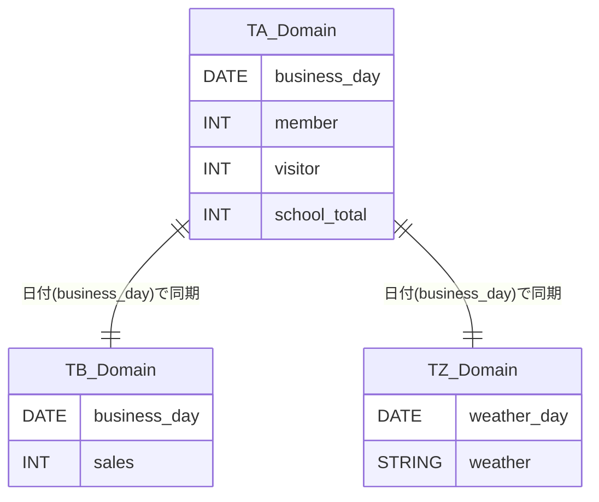

# GFdash データベース総合仕様書

本ドキュメントは、ゴルフ練習場管理システム「GFdash」におけるデータベース設計の全体像を定義するインデックスページです。

## 1. データベース・ドメイン構成

GFdashのデータ構造は、その役割に応じて以下の3つのドメインに分割されています。各ドメインの詳細なテーブル定義はリンク先を参照してください。

### [TA系：来場者情報ドメイン](./db_schema_ta.md)
* **主な役割:** 日別・時間帯別の来場者数、および営業日（祝日・休業）の管理。
* **主要テーブル:** `ta215_attnd`, `ta216_attnd_attr`, `ta220_memo`

### [TB系：売上・日報ドメイン](./db_schema_tb.md)
* **主な役割:** レジ締めデータとの連携、現金管理、売上差額の管理。
* **主要テーブル:** `tb120_report`, `tb330_sales_diff`

### [TZ系：統合情報・マスタドメイン](./db_schema_tz.md)
* **主な役割:** 天候情報（気象庁連携）、名前マスタ、画面権限管理。
* **主要テーブル:** `tz101_weather_report`, `tz901_com_name`, `tz910_permission`

---

## 2. システム全体鳥瞰図 (High-Level ERD)

システム全体の主要なつながりを示す図です。すべてのドメインは `business_day`（または日付）をキーとして疎結合されています。

> **💡 設計上の特記事項**
> 基本的なプレフィックスのルールは上記の通りですが、一部の外部システム連携用テーブル（`tz201_dept_report`, `tz202_clerk_report`）については、名称が「TZ（統合・マスタ系）」であるものの、データの論理的な意味合い・役割としては「TB（売上・日報系）」に属しています。
> データ参照の際はご注意ください。

---

## 3. 共通設計・実装指針

本システムのデータベース設計における共通のルールです。

### 3.1 日付管理
* 原則として `DATE` 型を使用し、ファイル間のリレーションシップの基点とします。
* 外部連携データ（TB系）と内部管理データ（TA系）の整合性は、この日付キーによって担保されます。

### 3.2 フラグ管理（ビット演算の活用）
* 状態管理（時間帯別休業、差額発生時間帯など）には、数値型（INT）を用いたビットフラグ管理を積極的に活用しています。
* これにより、カラム数を抑えつつ、複数の状態の組み合わせを一つのフィールドで柔軟に表現しています。
* **例:** `1` (朝), `2` (昼), `4` (夜) の論理和で状態を判定。

### 3.3 権限レベルの定義
システム内の画面アクセス権限（`tz910_permission`）は以下の数値で管理されます。
* `-1`: 非表示（Hidden）
* `0`: 一般スタッフ（Staff）
* `1`: マネージャー（Manager）
* `2`: システム管理者（Admin）

## 4. コード仕様
本システムの各種マスタコードについては、以下のドキュメントを参照してください。

👉 **[GFdash コード・定数定義書](./codes.md)**

---
[README.md へ戻る](../README.md)