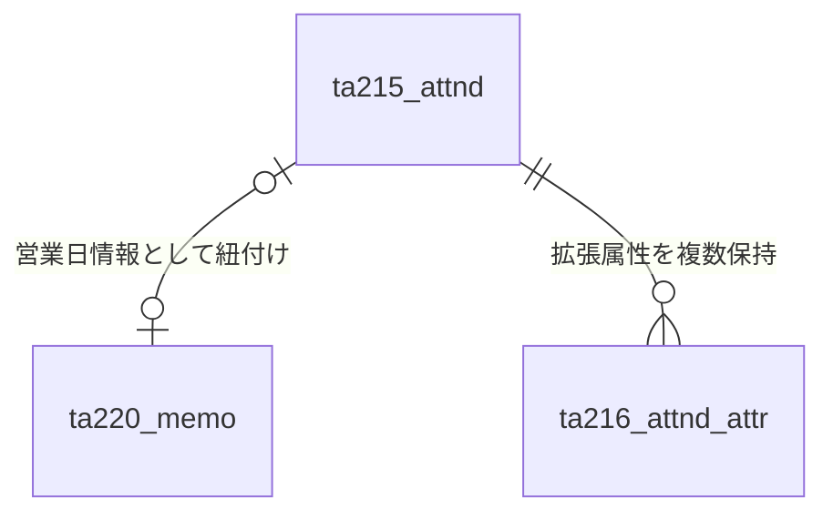

# GFdash データベース仕様書（TA：来場者情報系）

本ドキュメントでは、ゴルフ練習場管理システム「GFdash」で利用するPostgreSQLデータベースのテーブル構造を定義します。

## 1. テーブル一覧

| テーブル物理名 | テーブル論理名 | 概要 |
| :--- | :--- | :--- |
| `ta215_attnd` | 来場者情報（ダッシュボード専用） | 日別・時間帯別・属性別の来場者数を管理するメインテーブル |
| `ta216_attnd_attr` | 来場者情報拡張属性 | 将来的な拡張や、特定の属性（新規来場者等）を保持するサブテーブル |
| `ta220_memo` | 備考情報 | 祝日・休業フラグ、特別営業日、および日別のメモを管理 |

---

## 2. 全体関係図 (ER図)

各テーブルは `business_day` (営業日) をキーとして関連付けられています。

---

## 3. テーブル詳細定義

### 3.1 ta215_attnd (来場者情報テーブル)

| カラム名 (物理名) | 項目名 (論理名) | データ型 | 制約 | デフォルト値 | 備考 |
| :--- | :--- | :--- | :--- | :--- | :--- |
| `business_day` | 営業日 | DATE | **PK** | - | |
| `early_morn` | 早朝来場者数 | INT | | `0` | 未使用・予約 |
| `morning` | 午前来場者数 | INT | | `0` | OP-12:00 |
| `afternoon` | 日中来場者数 | INT | | `0` | 12:00-17:00 |
| `night` | 夜来場者数 | INT | | `0` | 17:00- |
| `late_night` | 深夜来場者数 | INT | | `0` | 未使用・予約 |
| `member` | メンバー人数 | INT | | `0` | |
| `visitor` | ビジター人数 | INT | | `0` | |
| `int_school` | 内部スクール | INT | | `0` | |
| `ext_school` | 外部スクール | INT | | `0` | |
| `school_total` | スクール合計 | INT | | `0` | |
| `input_date` | データ入力日 | DATE | | `CURRENT_DATE` | |

---

### 3.2 ta216_attnd_attr (来場者数拡張・未定項目)

| カラム名 (物理名) | 項目名 (論理名) | データ型 | 制約 | デフォルト値 | 備考 |
| :--- | :--- | :--- | :--- | :--- | :--- |
| `business_day` | 日付 | DATE | **PK** | - | |
| `attr_name` | 属性名 | VARCHAR(50) | **PK** | - | 例: 'new_visitor' |
| `val` | 数値 | INT | | `0` | |
| `input_date` | データ入力日 | DATE | | `CURRENT_DATE` | |

---

### 3.3 ta220_memo (備考情報テーブル)

| カラム名 (物理名) | 項目名 (論理名) | データ型 | 制約 | デフォルト値 | 備考 |
| :--- | :--- | :--- | :--- | :--- | :--- |
| `business_day` | 日付 | DATE | **PK** | - | |
| `holiday_flg` | 祝日フラグ | BOOLEAN | | `FALSE` | |
| `tokubetu_flg` | 特別営業日フラグ | BOOLEAN | | `FALSE` | |
| `closed_flg` | 休業フラグ | BOOLEAN | | `FALSE` | |
| `temp_closed` | 時間休業フラグ | INT | | `0` | **※下部ビット定義参照** |
| `memo` | 備考 | VARCHAR(255) | | - | |
| `input_date` | データ入力日 | DATE | | `CURRENT_DATE` | |

#### ※ `temp_closed` (時間休業フラグ) のビット定義
* `1` (2^0) : 朝休業
* `2` (2^1) : 昼休業
* `4` (2^2) : 夜休業

---
[db_schema_index.md へ戻る](./db_schema_index.md)