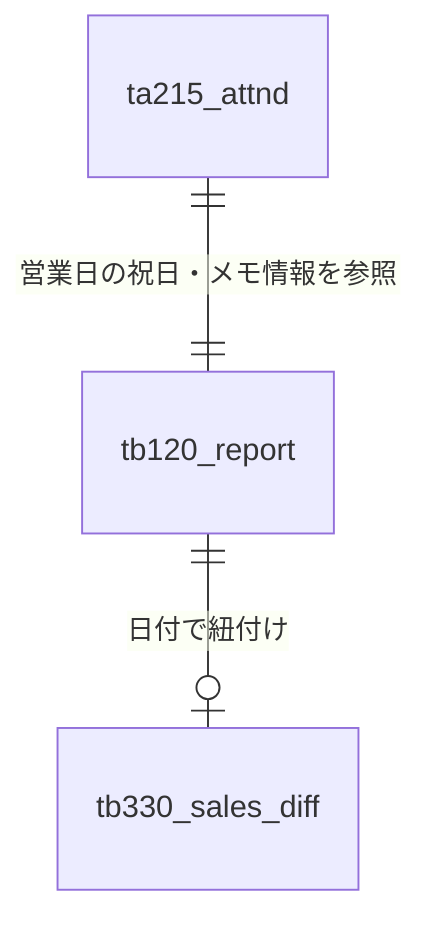

# GFdash データベース仕様書（TB：売上・日報系）

本ドキュメントでは、GFdashで利用する売上管理および日報連携用テーブル（TB系）の構造を定義します。

## 1. テーブル一覧

| テーブル物理名 | テーブル論理名 | 概要 |
| :--- | :--- | :--- |
| `tb120_report` | 日報テーブル | レジの現金有高、入出金、部門別売上などの日次データを管理 |
| `tb330_sales_diff` | 売上差額テーブル | 時間帯ごとの売上差額（過不足等）をビットフラグで管理 |

---

## 2. 関係図 (ER図)

売上データは、基本的に `business_day` (取引日付) を主軸に管理されます。

---

## 3. テーブル詳細定義

### 3.1 tb120_report (日報テーブル)

Accessシステム等からインポートされる、レジ締め後の確定データを保持します。

| カラム名 (物理名) | 項目名 (論理名) | データ型 | 制約 | デフォルト値 | 備考 |
| :--- | :--- | :--- | :--- | :--- | :--- |
| `business_day` | 取引日付 | DATE | **PK** | - | |
| `aridaka` | 現金有高 | INT | | - | レジ内現金合計 |
| `nyukin` | 入金 | INT | | - | 特別利用、施設利用料等 |
| `shukkin` | 出金 | INT | | - | 店頭購入、精算金等 |
| `sagaku` | 現金差額 | INT | | - | レジ過不足 |
| `ken` | 券 | INT | | - | 値引券、クーポン等 |
| `school` | スクール売上 | INT | | - | |
| `shop` | ショップ売上 | INT | | - | |
| `input_date` | 更新日付 | DATE | | - | |

---

### 3.2 tb330_sales_diff (売上差額テーブル)

時間帯ごとの売上変動や補正値を管理します。

| カラム名 (物理名) | 項目名 (論理名) | データ型 | 制約 | デフォルト値 | 備考 |
| :--- | :--- | :--- | :--- | :--- | :--- |
| `diff_date` | 日付 | DATE | | - | 取引日 |
| `diff_sales` | 差額数値 | INT | | - | 金額 |
| `diff_time_flg` | 差額発生時間フラグ | INT | | - | **※下部ビット定義参照** |
| `input_date` | 更新日付 | DATE | | - | |

#### ※ `diff_time_flg` (差額発生時間フラグ) のビット定義
16進数（0x）表記によるビットフラグで時間帯を指定します。
* `0x001` (1) : 朝
* `0x020` (32) : 昼
* `0x100` (256) : 夜
> **例:** 0x121 (289) のような組み合わせで、複数の時間帯を表現可能です。

---
[db_schema_index.md へ戻る](./db_schema_index.md)