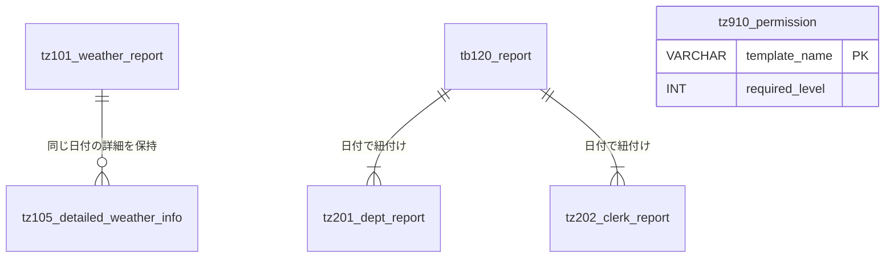

# GFdash データベース仕様書（TZ：統合情報・マスタ系）

本ドキュメントでは、GFdashで利用する天候情報、外部連携データ、およびシステム全体のマスタ・権限管理用テーブル（TZ系）の構造を定義します。

## 1. テーブル一覧

| テーブル物理名 | テーブル論理名 | 概要 |
| :--- | :--- | :--- |
| `tz101_weather_report` | 天候情報テーブル | 日別の気象情報（気温、降水量、風速、概況など） |
| `tz102_weather_avarage` | 天候情報(平年値)テーブル | 指定月日（mmdd）ごとの平年値データ |
| `tz105_detailed_weather_info` | 天候情報(時別詳細)テーブル | 1時間ごとの詳細な気象観測データ |
| `tz201_dept_report` | DEPTテーブル | 部門別売上などの外部システム連携用データ |
| `tz202_clerk_report` | CLERKテーブル | 区分（担当者別等）売上などの外部システム連携用データ |
| `tz901_com_name` | 名前マスタ | コード値と名称（スクール名やアメダス地点など）の対応表 |
| `tz910_permission` | 画面表示パーミッション | Djangoテンプレートごとのアクセス権限レベルを管理 |

---

## 2. 関係図 (ER図)

---

## 3. テーブル詳細定義

### 3.1 天候情報テーブル群

#### tz101_weather_report (天候情報テーブル)
| カラム名 (物理名) | 項目名 (論理名) | データ型 | 制約 | デフォルト値 | 備考 |
| :--- | :--- | :--- | :--- | :--- | :--- |
| `weather_day` | 日付 | DATE | **PK** | - | |
| `temp_max` | 最高気温 | NUMERIC(5,2) | | - | |
| `temp_min` | 最低気温 | NUMERIC(5,2) | | - | |
| `temp_ave` | 平均気温 | NUMERIC(5,2) | | - | |
| `rainfall_hour_max`| 最大降水量(1h) | NUMERIC(5,2) | | - | |
| `wind_max_speed` | 日最大風速 | NUMERIC(5,2) | | - | |
| `wind_max_direction`| 日最大風速(風向) | VARCHAR(255) | | - | |
| `wind_max_inst` | 日最大瞬間風速 | NUMERIC(5,2) | | - | |
| `wind_max_inst_dir`| 日最大瞬間風速(風向)| VARCHAR(255) | | - | |
| `gaikyo` | 天気概況(日中) | VARCHAR(255) | | - | 6-18時 |
| `gaikyo_night` | 天気概況(夜間) | VARCHAR(255) | | - | 18-翌6時 |
| `input_date` | 登録日 | DATE | | `CURRENT_DATE` | |

#### tz102_weather_avarage (天候情報 平年値テーブル)
| カラム名 (物理名) | 項目名 (論理名) | データ型 | 制約 | 備考 |
| :--- | :--- | :--- | :--- | :--- |
| `weather_mmdd` | 日付(mmdd形式) | VARCHAR(4) | **PK** | 例: '0413' |
| `weather_mm` | 月 | NUMERIC(2) | | |
| `weather_dd` | 日 | NUMERIC(2) | | |
| `temp_max` | 最高気温 | NUMERIC(5,2) | | |
| `temp_min` | 最低気温 | NUMERIC(5,2) | | |
| `temp_ave` | 平均気温 | NUMERIC(5,2) | | |

#### tz105_detailed_weather_info (天候情報 時別詳細テーブル)
| カラム名 (物理名) | 項目名 (論理名) | データ型 | 制約 | デフォルト値 | 備考 |
| :--- | :--- | :--- | :--- | :--- | :--- |
| `id` | ID | SERIAL | **PK** | - | Django自動採番用 |
| `weather_day` | 年月日 | DATE | **UQ** | - | |
| `weather_time` | 時 (0-23) | INT | **UQ** | - | `weather_day`と複合ユニーク |
| `temp` | 気温 | NUMERIC(5,2) | | - | |
| `rainfall` | 降水量 | NUMERIC(5,2) | | - | |
| `wind_speed` | 風速 | NUMERIC(5,2) | | - | |
| `wind_direction` | 風向 | VARCHAR(255) | | - | |
| `weather_num` | 天気番号 | INT | | - | 天気符号値を使用 |
| `input_date` | 取り込み日 | DATE | | `CURRENT_DATE` | |

---

### 3.2 外部連携テーブル (DEPT / CLERK)

#### tz201_dept_report (DEPTテーブル)
| カラム名 (物理名) | 項目名 (論理名) | データ型 | 制約 | 備考 |
| :--- | :--- | :--- | :--- | :--- |
| `business_day` | 取引日付 | DATE | **PK** | |
| `code` | コード | INT | **PK** | ※具体的なコードの中身は [コード定義書](./codes.md) を参照 |
| `num` | 枝番 | INT | **PK** | |
| `sales` | 金額 | INT | | |

#### tz202_clerk_report (CLERKテーブル)
| カラム名 (物理名) | 項目名 (論理名) | データ型 | 制約 | 備考 |
| :--- | :--- | :--- | :--- | :--- |
| `business_day` | 取引日付 | DATE | **PK** | |
| `code` | コード | INT | **PK** | ※具体的なコードの中身は [コード定義書](codes.md) を参照 |
| `trans_num` | 取引点数 | INT | | |
| `sales_num` | 売上点数 | INT | | |
| `sales` | 金額 | INT | | |
| `input_date` | 更新日付 | DATE | | |

---

### 3.3 マスタ・管理テーブル

#### tz901_com_name (名前マスタ)
コード値に対する名称を管理します。

| カラム名 (物理名) | 項目名 (論理名) | データ型 | 制約 | 備考 |
| :--- | :--- | :--- | :--- | :--- |
| `code` | コード | INT | **PK** | ※具体的なコードの中身は [コード定義書](codes.md) を参照 |
| `num` | 枝番 | INT | **PK** | |
| `code_name` | 名称 | VARCHAR(255)| | |
| `code_name2` | 名称(省略) | VARCHAR(50) | | |

#### tz910_permission (画面表示パーミッション)
ダッシュボードシステム内の各画面（メニュー）へのアクセス権限を管理します。

| カラム名 (物理名) | 項目名 (論理名) | データ型 | 制約 | 備考 |
| :--- | :--- | :--- | :--- | :--- |
| `template_name` | 画面名 | VARCHAR(100)| **PK** | テンプレートのファイル名 |
| `required_level` | 必要権限レベル | INT | | ※値の定義については [コード定義書](codes.md) を参照 |
| `memo` | 備考 | VARCHAR(200)| | |

---
[db_schema_index.md へ戻る](./db_schema_index.md)