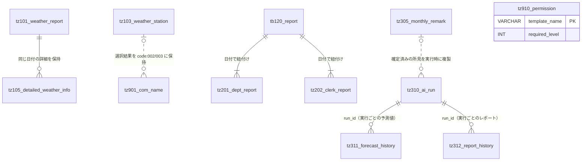

# GFdash データベース仕様書（TZ：統合情報・マスタ系）

本ドキュメントでは、GFdashで利用する天候情報、外部連携データ、およびシステム全体のマスタ・権限管理用テーブル（TZ系）の構造を定義します。

## 1. テーブル一覧

| テーブル物理名 | テーブル論理名 | 概要 |
| :--- | :--- | :--- |
| `tz101_weather_report` | 天候情報テーブル | 日別の気象情報（気温、降水量、風速、概況など） |
| `tz102_weather_avarage` | 天候情報(平年値)テーブル | 指定月日（mmdd）ごとの平年値データ |
| `tz103_weather_station` | 気象観測地点マスタ | 気象庁の観測地点（気象官署／アメダス）一覧。設定画面の選択肢に使用 |
| `tz105_detailed_weather_info` | 天候情報(時別詳細)テーブル | 1時間ごとの詳細な気象観測データ |
| `tz201_dept_report` | DEPTテーブル | 部門別売上などの外部システム連携用データ |
| `tz202_clerk_report` | CLERKテーブル | 区分（担当者別等）売上などの外部システム連携用データ |
| `tz301_forecast` | 来場者予測情報テーブル | 予測バッチが出した**最新**の日別予測値 |
| `tz302_llm_analysis` | LLM分析月次レポート | AIが生成した**最新**の月次レポート本文 |
| `tz305_monthly_remark` | 月次所見 | 予測モデルが知りえない出来事の記録と、構造化した補正定義 |
| `tz310_ai_run` | AIバッチ実行ヘッダ | 予測・レポート生成の1回の実行と、その実行条件 |
| `tz311_forecast_history` | 来場者予測履歴 | 実行ごとの日別予測値。`tz301` + `run_id` |
| `tz312_report_history` | AI月次分析レポート履歴 | 実行ごとのレポート本文。`tz302` + `run_id` |
| `tz810_holiday2` | 第2休日カレンダー | 祝日とは異なる休日体系を持つ顧客層の操業カレンダー |
| `tz901_com_name` | 名前マスタ | コード値と名称（スクール名やアメダス地点など）の対応表 |
| `tz910_permission` | 画面表示パーミッション | Djangoテンプレートごとのアクセス権限レベルを管理 |

---

## 2. 関係図 (ER図)


```mermaid
erDiagram
    tz101_weather_report ||--o{ tz105_detailed_weather_info : "同じ日付の詳細を保持"
    tz103_weather_station |o..o{ tz901_com_name : "選択結果を code:002/003 に保持"
    
    tb120_report ||--|{ tz201_dept_report : "日付で紐付け"
    tb120_report ||--|{ tz202_clerk_report : "日付で紐付け"

    tz310_ai_run ||--o{ tz311_forecast_history : "run_id（実行ごとの予測値）"
    tz310_ai_run ||--o{ tz312_report_history : "run_id（実行ごとのレポート）"
    tz305_monthly_remark |o..o{ tz310_ai_run : "確定済みの所見を実行時に複製"

    tz910_permission {
        VARCHAR template_name PK
        INT required_level
    }
```

---

## 3. テーブル詳細定義

### 3.1 天候情報テーブル群

#### tz101_weather_report (天候情報テーブル)
| カラム名 (物理名) | 項目名 (論理名) | データ型 | 制約 | デフォルト値 | 備考 |
| :--- | :--- | :--- | :--- | :--- | :--- |
| `weather_day` | 日付 | DATE | **PK** | - | |
| `temp_max` | 最高気温 | NUMERIC(5,2) | | - | |
| `temp_min` | 最低気温 | NUMERIC(5,2) | | - | |
| `temp_ave` | 平均気温 | NUMERIC(5,2) | | - | |
| `rainfall_hour_max`| 最大降水量(1h) | NUMERIC(5,2) | | - | |
| `wind_max_speed` | 日最大風速 | NUMERIC(5,2) | | - | |
| `wind_max_direction`| 日最大風速(風向) | VARCHAR(255) | | - | |
| `wind_max_inst` | 日最大瞬間風速 | NUMERIC(5,2) | | - | |
| `wind_max_inst_dir`| 日最大瞬間風速(風向)| VARCHAR(255) | | - | |
| `gaikyo` | 天気概況(日中) | VARCHAR(255) | | - | 6-18時 |
| `gaikyo_night` | 天気概況(夜間) | VARCHAR(255) | | - | 18-翌6時 |
| `input_date` | 登録日 | DATE | | `CURRENT_DATE` | |

#### tz102_weather_avarage (天候情報 平年値テーブル)
| カラム名 (物理名) | 項目名 (論理名) | データ型 | 制約 | 備考 |
| :--- | :--- | :--- | :--- | :--- |
| `weather_mmdd` | 日付(mmdd形式) | VARCHAR(4) | **PK** | 例: '0413' |
| `weather_mm` | 月 | NUMERIC(2) | | |
| `weather_dd` | 日 | NUMERIC(2) | | |
| `temp_max` | 最高気温 | NUMERIC(5,2) | | |
| `temp_min` | 最低気温 | NUMERIC(5,2) | | |
| `temp_ave` | 平均気温 | NUMERIC(5,2) | | |

#### tz103_weather_station (気象観測地点マスタ)
気象庁の観測地点（気象官署／アメダス）の一覧を保持する参照専用マスタです。
気象観測地点設定画面（910）で天候情報の取得元を選択する際に参照します。

選択した結果は `tz901_com_name` の code:002（地点名）／code:003（地点コード）へ
書き込まれ、実際の気象データ取得（`get_daily_weather`）はそちらを参照します。
本テーブルは選択肢を提示するためだけに存在し、運用中に更新する必要はありません。

| カラム名 (物理名) | 項目名 (論理名) | データ型 | 制約 | 備考 |
| :--- | :--- | :--- | :--- | :--- |
| `id` | ID | SERIAL | **PK** | Django用の代理キー |
| `prec_no` | 都府県・地方コード | VARCHAR(4) | NOT NULL, **UQ** | 気象庁URLの `prec_no` |
| `block_no` | 観測地点コード | VARCHAR(8) | NOT NULL, **UQ** | 気象庁URLの `block_no` |
| `station_type` | 地点種別 | CHAR(1) | NOT NULL | `s`:気象官署 / `a`:アメダス |
| `prec_name` | 都府県・地方名 | VARCHAR(50) | NOT NULL | 例: '東京' |
| `station_name` | 観測地点名 | VARCHAR(50) | NOT NULL | 例: '羽田' |
| `has_rainfall` | 降水量観測 | BOOLEAN | NOT NULL | 気象庁の `f_pre` |
| `has_wind` | 風速観測 | BOOLEAN | NOT NULL | 気象庁の `f_wsp` |
| `has_temp` | 気温観測 | BOOLEAN | NOT NULL | 気象庁の `f_tem` |
| `end_date` | 観測終了日 | DATE | | NULLなら現役 |

`station_type` は取得先URLの分岐に使用します。気象官署は `daily_s1.php`、
アメダスは `daily_a1.php` を参照するため、種別を誤ると気象データを取得できません。
なお `block_no` は気象官署が5桁（WMO観測所番号）、アメダスが4桁で、両者は桁数でも区別できます。

`has_*` と `end_date` は設定画面(910)で選択肢を絞り込むために保持しています。
アメダスには降水量しか観測しない地点が全体の約1/4あり、それを選ぶと気温・風速が
永久にNULLになります。また廃止済みの地点が同名の現役地点と並ぶため
（例: 新島・神津島）、`end_date` が入っている地点は選択肢から除外します。

初期データの生成手順は [README.md](../README.md) を参照してください。

#### tz105_detailed_weather_info (天候情報 時別詳細テーブル)
| カラム名 (物理名) | 項目名 (論理名) | データ型 | 制約 | デフォルト値 | 備考 |
| :--- | :--- | :--- | :--- | :--- | :--- |
| `id` | ID | SERIAL | **PK** | - | Django自動採番用 |
| `weather_day` | 年月日 | DATE | **UQ** | - | |
| `weather_time` | 時 (0-23) | INT | **UQ** | - | `weather_day`と複合ユニーク |
| `temp` | 気温 | NUMERIC(5,2) | | - | |
| `rainfall` | 降水量 | NUMERIC(5,2) | | - | |
| `wind_speed` | 風速 | NUMERIC(5,2) | | - | |
| `wind_direction` | 風向 | VARCHAR(255) | | - | |
| `weather_num` | 天気番号 | INT | | - | 天気符号値を使用 |
| `input_date` | 取り込み日 | DATE | | `CURRENT_DATE` | |

---

### 3.2 外部連携テーブル (DEPT / CLERK)

#### tz201_dept_report (DEPTテーブル)
| カラム名 (物理名) | 項目名 (論理名) | データ型 | 制約 | 備考 |
| :--- | :--- | :--- | :--- | :--- |
| `business_day` | 取引日付 | DATE | **PK** | |
| `code` | コード | INT | **PK** | ※具体的なコードの中身は [コード定義書](./codes.md) を参照 |
| `num` | 枝番 | INT | **PK** | |
| `sales` | 金額 | INT | | |

#### tz202_clerk_report (CLERKテーブル)
| カラム名 (物理名) | 項目名 (論理名) | データ型 | 制約 | 備考 |
| :--- | :--- | :--- | :--- | :--- |
| `business_day` | 取引日付 | DATE | **PK** | |
| `code` | コード | INT | **PK** | ※具体的なコードの中身は [コード定義書](codes.md) を参照 |
| `trans_num` | 取引点数 | INT | | |
| `sales_num` | 売上点数 | INT | | |
| `sales` | 金額 | INT | | |
| `input_date` | 更新日付 | DATE | | |

---

### 3.3 予測テーブル 

予測とレポートは「**最新**」と「**実行履歴**」を分けて保持します。

- `tz301` / `tz302` … 最新の1回分。画面・ラズパイ同期（905）が読む既存の経路
- `tz310` / `tz311` / `tz312` … 実行ごとの記録。比較画面（415）が読む

`tz301` に `run_id` を足して履歴化しなかったのは、ラズパイ同期が `tz301` を
そのままの形で読み書きしているためです。キーを変えると同期の両端に改修が必要になります。

#### tz301_forecast (来場者予測情報テーブル)
| カラム名 (物理名) | 項目名 (論理名) | データ型 | 制約 | 備考 |
| :--- | :--- | :--- | :--- | :--- |
| `business_day` | 予測対象日 | DATE | **PK** | |
| `target_cls` | 予測対象区分 | VARCHAR(255) | **PK** |  |
| `yhat` | 予測値 | FLOAT | | |
| `yhat_lower` | 予測下限値 | FLOAT | | |
| `yhat_upper` | 予測上限値 | FLOAT | | |
| `input_date` | データ入力日 | DATE | | |

#### tz302_llm_analysis (LLM分析月次レポート)
| カラム名 (物理名) | 項目名 (論理名) | データ型 | 制約 | 備考 |
| :--- | :--- | :--- | :--- | :--- |
| `target_month` | 対象月 | DATE | **PK** | |
| `report_cls` | レポート区分 | VARCHAR(20) | **PK** |  |
| `report_text` | AI分析レポート | TEXT | | |
| `input_date` | データ入力日 | DATE | | |

#### tz305_monthly_remark (月次所見)
予測モデルもAIも知りようのない出来事を、運営者が自由文で書き残す場所です。
「近隣に競合が開業した」「ボールを全交換した」といった情報は実績データに現れる前から
分かっており、人しか持っていません。

自由文のままでは予測に使えないため、構造化した結果を `parsed_json` に置きます。
予測とレポートが読むのは `parsed_json` だけで、`remark_text` は人が読み返すために残します。

**AIを必須にしない設計です。** `parsed_json` はAIに解析させても、画面から手で組み立てても
同じ形になります。推論エンジンを用意できない環境でも、所見メンテナンス画面（413）から
入力すれば同じ経路で補正が効きます。

| カラム名 (物理名) | 項目名 (論理名) | データ型 | 制約 | デフォルト値 | 備考 |
| :--- | :--- | :--- | :--- | :--- | :--- |
| `id` | ID | SERIAL | **PK** | - | Django用の単独主キー |
| `target_month` | 対象月 | DATE | **UQ** | - | 必ず1日の日付で保持 |
| `remark_cls` | 所見区分 | VARCHAR(20) | **UQ** | - | `forecast`:予測所見 / `review`:振り返り所見 |
| `remark_text` | 所見 | TEXT | NOT NULL | `''` | 手入力の自由文 |
| `parsed_json` | 解析結果 | TEXT | | - | 構造化した補正定義。下記参照 |
| `parsed_at` | 解析日時 | TIMESTAMPTZ | | - | |
| `parsed_model` | 解析モデル | VARCHAR(100) | | - | 手入力なら NULL |
| `parse_status` | 解析状態 | VARCHAR(20) | NOT NULL | `none` | `none`:未解析 / `parsed`:解析済み・未確認 / `confirmed`:確認済み |
| `updated_by` | 更新者 | VARCHAR(150) | | - | |
| `updated_at` | 更新日時 | TIMESTAMPTZ | NOT NULL | `CURRENT_TIMESTAMP` | |

区分を分けているのは、同じ月でも「これから先を見通すための情報」と「済んだ月を
振り返るための情報」では書く内容も時点も違うためです。1行にまとめると、予測を回すたびに
振り返りの記述まで読ませることになります。

**補正に使うのは `parse_status = 'confirmed'` の行だけです。** AIが出した係数をそのまま
予測へ流すと、根拠の無い数値が実績のように扱われます。人が見て確定させる一段を挟みます。

**予測の補正に使うのは `remark_cls = 'forecast'` だけです。** 振り返り所見は「何が起きたか」の
記録で、振り返りレポートの材料にしかなりません。起きたことは実績に出ており、見立てを置く
意味が無いためです。振り返り所見の `parsed_json` は空で構いません（補正を切り離す前に
作られた行にはイベントが残っていることがあり、それはレポートの材料として読まれます）。

##### parsed_json の形

```json
{
  "events": [
    {
      "name": "近隣に競合施設が開業",
      "type": "level_shift",
      "start_date": "2026-10-01",
      "end_date": null,
      "factor_mid": 0.95, "factor_low": 0.90, "factor_high": 1.00,
      "rationale": "10月上旬に開業。同規模施設の前例では…",
      "use_for_forecast": true,
      "use_for_report": true,
      "ack": false
    }
  ]
}
```

| 要素 | 内容 |
| :--- | :--- |
| `name` | イベント名 |
| `type` | `level_shift`:恒久（`end_date` は null 可） / `period`:期間限定 / `note`:文章の材料のみ |
| `start_date` / `end_date` | 期間（`YYYY-MM-DD`） |
| `factor_mid` / `factor_low` / `factor_high` | 中央値・下限・上限への乗率。NULL なら予測に影響させない |
| `rationale` | なぜその数値にしたかの根拠 |
| `use_for_forecast` / `use_for_report` | 予測の補正に使うか / レポートの材料に使うか |
| `ack` | 本文から導けない値であることを人が承知したか |

`ack` は「要確認」の指摘を閉じるための印です。所見に数量が書かれていなくても、
経験から見立てを置くことはあります。その場合、指摘は値を直しても消えません
（本文に無いという事実は変わらないため）。承知したことを残せないと、
消えない指摘を無視する癖が付きます。値を変えると `false` に戻ります。

係数を3点で持つのは、人の見立てによる補正で上下限に同じ値を掛けると
**不確実性が増えているのに予測幅が広がらない**という誤った出力になるためです。
休業補正が上下限へ同率を掛けているのは、営業時間という確定情報だから成り立ちます。

月をまたぐイベントは `end_date` で表します。予測は全月の所見からイベントを集めて
適用するため、キーが月であることは制約になりません。

#### tz310_ai_run (AIバッチ実行ヘッダ)
予測（`run_forecast`）とレポート生成（`run_llm_analysis`）の1回の実行を1行で表します。
実行結果そのものは `tz311` / `tz312` に持ち、この表は「**どういう条件で実行したか**」を持ちます。

予測バッチは毎回すべての履歴で再学習するため、前回との差が「補正を変えたから」なのか
「再学習で動いたから」なのか、条件の記録が無いと区別できません。

| カラム名 (物理名) | 項目名 (論理名) | データ型 | 制約 | デフォルト値 | 備考 |
| :--- | :--- | :--- | :--- | :--- | :--- |
| `run_id` | 実行ID | SERIAL | **PK** | - | |
| `run_kind` | 実行区分 | VARCHAR(20) | NOT NULL | - | `forecast`:来場者予測 / `report`:LLM分析レポート |
| `executed_at` | 実行日時 | TIMESTAMPTZ | NOT NULL | `CURRENT_TIMESTAMP` | |
| `status` | 状態 | VARCHAR(20) | NOT NULL | `running` | `running` / `done` / `failed` |
| `script_version` | スクリプト版 | VARCHAR(20) | | - | バッチの `SCRIPT_VERSION` |
| `prompt_version` | プロンプト版 | VARCHAR(20) | | - | スクリプト版とは別に持つ |
| `history_from` | 履歴保存の下限日 | DATE | | - | `tz311`/`tz312` を保存した下限。通常は実行した月の1日 |
| `periods` | 予測日数 | INT | | - | `forecast` のみ |
| `holiday2_enabled` | 第2休日の利用 | BOOLEAN | | - | `forecast` のみ |
| `closure_sample_count` | 休業補正の実績日数 | INT | | - | `forecast` のみ。係数算出に使った日数 |
| `llm_model` | LLMモデル | VARCHAR(100) | | - | `report` のみ |
| `llm_preset` | 実行プリセット | VARCHAR(20) | | - | `report` のみ |
| `applied_remark_json` | 採用した所見 | TEXT | | - | その実行で採用した所見の複製（参照ではなくスナップショット） |
| `note` | メモ | TEXT | | - | 手入力メモ。補正の上限クリップが効いた旨も追記 |

`applied_remark_json` は所見を参照せず**複製**します。所見は後から書き換えられるため、
参照にすると「この実行が何を掛けたか」が失われ、補正の効果を検証できなくなります。

#### tz311_forecast_history (来場者予測履歴)
`tz301_forecast` と同じ列に `run_id` を足したものです。保存するのは
**実行した月の1日以降**だけで、過去日の当てはめ値は残しません（再学習の副産物であり比較対象ではない）。

| カラム名 (物理名) | 項目名 (論理名) | データ型 | 制約 | デフォルト値 | 備考 |
| :--- | :--- | :--- | :--- | :--- | :--- |
| `id` | ID | SERIAL | **PK** | - | Django用の単独主キー |
| `run_id` | 実行ID | INT | **UQ** / FK | - | → `tz310_ai_run` (ON DELETE CASCADE) |
| `business_day` | 予測対象日 | DATE | **UQ** | - | |
| `target_cls` | 予測対象区分 | VARCHAR(255) | **UQ** | - | `tz301` と同じ |
| `yhat` | 予測値 | FLOAT | NOT NULL | - | |
| `yhat_lower` | 予測下限値 | FLOAT | NOT NULL | - | |
| `yhat_upper` | 予測上限値 | FLOAT | NOT NULL | - | |
| `input_date` | データ入力日 | DATE | NOT NULL | `CURRENT_DATE` | |

#### tz312_report_history (AI月次分析レポート履歴)
`tz302_llm_analysis` と同じ列に `run_id` を足したものです。所見やプロンプトを変えて
再生成したとき、前の文章が残っていないと良くなったのか判断できないため持ちます。

| カラム名 (物理名) | 項目名 (論理名) | データ型 | 制約 | デフォルト値 | 備考 |
| :--- | :--- | :--- | :--- | :--- | :--- |
| `id` | ID | SERIAL | **PK** | - | Django用の単独主キー |
| `run_id` | 実行ID | INT | **UQ** / FK | - | → `tz310_ai_run` (ON DELETE CASCADE) |
| `target_month` | 対象月 | DATE | **UQ** | - | 必ず1日の日付で保持 |
| `report_cls` | レポート区分 | VARCHAR(20) | **UQ** | - | `tz302` と同じ |
| `report_text` | AI分析レポート | TEXT | NOT NULL | - | |
| `input_date` | データ入力日 | DATE | NOT NULL | `CURRENT_DATE` | |

---

### 3.4 カレンダーテーブル

#### tz810_holiday2 (第2休日カレンダー)
国民の祝日とは異なる休日体系を持つ顧客層（近隣の主要事業所など）の操業
カレンダーを保持します。その休日は来場者数に影響しますが、祝日とも曜日とも
一致しないため、予測モデルの週次季節性・祝日効果では説明できません。

`ta` 系ではなく `tz` 系に置いているのは、このデータが来場者数管理システムから
同期されるものではなく、本システム側で入力・保持するものであるためです。

| カラム名 (物理名) | 項目名 (論理名) | データ型 | 制約 | 備考 |
| :--- | :--- | :--- | :--- | :--- |
| `id` | ID | SERIAL | **PK** | Django用の単独主キー |
| `calendar_cls` | カレンダー種別 | INT | UQ | `tz901` code:008 の `num` に対応 |
| `business_day` | 対象日 | DATE | UQ | |
| `day_cls` | 日区分 | SMALLINT | | 1:休日 / 2:稼働日（既定 1） |
| `memo` | 備考 | VARCHAR(255) | | 連休の名称など |
| `input_date` | 入力日 | DATE | | |

一意性は `(calendar_cls, business_day)` の UNIQUE 制約で担保します。複合キーの
一方を主キーに宣言すると `update_or_create()` が同じ値の行をまとめて更新して
壊すため、`tz302` と同じく単独の `id` を持たせています。

**行が必要なのは「通常の週パターンと食い違う日」だけです。** 土日を休日として
登録する必要はありません。曜日の効果は週次季節性が既に学習しており、重複して
与えると係数が不安定になります。

`day_cls=2`（稼働日）は「通常は休みだが操業している日」を表します。土曜の
振替出勤のほか、**祝日が操業日になっている場合**にも使います。工場カレンダーでは
祝日の多くが操業日になるため、休日だけでは実態を表現できません。

---

### 3.5 マスタ・管理テーブル

#### tz901_com_name (名前マスタ)
コード値に対する名称を管理します。

| カラム名 (物理名) | 項目名 (論理名) | データ型 | 制約 | 備考 |
| :--- | :--- | :--- | :--- | :--- |
| `code` | コード | INT | **PK** | ※具体的なコードの中身は [コード定義書](codes.md) を参照 |
| `num` | 枝番 | INT | **PK** | |
| `code_name` | 名称 | VARCHAR(255)| | |
| `code_name2` | 名称(省略) | VARCHAR(50) | | |

#### tz910_permission (画面表示パーミッション)
ダッシュボードシステム内の各画面（メニュー）へのアクセス権限を管理します。

| カラム名 (物理名) | 項目名 (論理名) | データ型 | 制約 | 備考 |
| :--- | :--- | :--- | :--- | :--- |
| `template_name` | 画面名 | VARCHAR(100)| **PK** | テンプレートのファイル名 |
| `required_level` | 必要権限レベル | INT | | ※値の定義については [コード定義書](codes.md) を参照 |
| `memo` | 備考 | VARCHAR(200)| | |

---
[db_schema_index.md へ戻る](./db_schema_index.md)