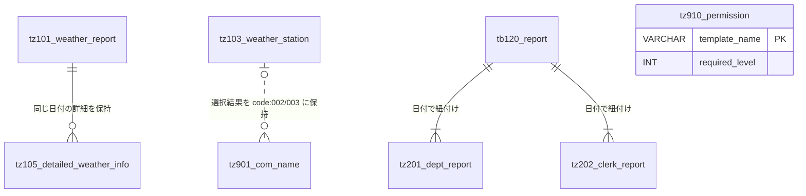

# GFdash データベース仕様書（TZ：統合情報・マスタ系）

本ドキュメントでは、GFdashで利用する天候情報、外部連携データ、およびシステム全体のマスタ・権限管理用テーブル（TZ系）の構造を定義します。

## 1. テーブル一覧

| テーブル物理名 | テーブル論理名 | 概要 |
| :--- | :--- | :--- |
| `tz101_weather_report` | 天候情報テーブル | 日別の気象情報（気温、降水量、風速、概況など） |
| `tz102_weather_avarage` | 天候情報(平年値)テーブル | 指定月日（mmdd）ごとの平年値データ |
| `tz103_weather_station` | 気象観測地点マスタ | 気象庁の観測地点（気象官署／アメダス）一覧。設定画面の選択肢に使用 |
| `tz105_detailed_weather_info` | 天候情報(時別詳細)テーブル | 1時間ごとの詳細な気象観測データ |
| `tz201_dept_report` | DEPTテーブル | 部門別売上などの外部システム連携用データ |
| `tz202_clerk_report` | CLERKテーブル | 区分（担当者別等）売上などの外部システム連携用データ |
| `tz901_com_name` | 名前マスタ | コード値と名称（スクール名やアメダス地点など）の対応表 |
| `tz910_permission` | 画面表示パーミッション | Djangoテンプレートごとのアクセス権限レベルを管理 |

---

## 2. 関係図 (ER図)

```mermaid
erDiagram
    tz101_weather_report ||--o{ tz105_detailed_weather_info : "同じ日付の詳細を保持"
    tz103_weather_station |o..o{ tz901_com_name : "選択結果を code:002/003 に保持"
    
    tb120_report ||--|{ tz201_dept_report : "日付で紐付け"
    tb120_report ||--|{ tz202_clerk_report : "日付で紐付け"

    tz910_permission {
        VARCHAR template_name PK
        INT required_level
    }
```

---

## 3. テーブル詳細定義

### 3.1 天候情報テーブル群

#### tz101_weather_report (天候情報テーブル)
| カラム名 (物理名) | 項目名 (論理名) | データ型 | 制約 | デフォルト値 | 備考 |
| :--- | :--- | :--- | :--- | :--- | :--- |
| `weather_day` | 日付 | DATE | **PK** | - | |
| `temp_max` | 最高気温 | NUMERIC(5,2) | | - | |
| `temp_min` | 最低気温 | NUMERIC(5,2) | | - | |
| `temp_ave` | 平均気温 | NUMERIC(5,2) | | - | |
| `rainfall_hour_max`| 最大降水量(1h) | NUMERIC(5,2) | | - | |
| `wind_max_speed` | 日最大風速 | NUMERIC(5,2) | | - | |
| `wind_max_direction`| 日最大風速(風向) | VARCHAR(255) | | - | |
| `wind_max_inst` | 日最大瞬間風速 | NUMERIC(5,2) | | - | |
| `wind_max_inst_dir`| 日最大瞬間風速(風向)| VARCHAR(255) | | - | |
| `gaikyo` | 天気概況(日中) | VARCHAR(255) | | - | 6-18時 |
| `gaikyo_night` | 天気概況(夜間) | VARCHAR(255) | | - | 18-翌6時 |
| `input_date` | 登録日 | DATE | | `CURRENT_DATE` | |

#### tz102_weather_avarage (天候情報 平年値テーブル)
| カラム名 (物理名) | 項目名 (論理名) | データ型 | 制約 | 備考 |
| :--- | :--- | :--- | :--- | :--- |
| `weather_mmdd` | 日付(mmdd形式) | VARCHAR(4) | **PK** | 例: '0413' |
| `weather_mm` | 月 | NUMERIC(2) | | |
| `weather_dd` | 日 | NUMERIC(2) | | |
| `temp_max` | 最高気温 | NUMERIC(5,2) | | |
| `temp_min` | 最低気温 | NUMERIC(5,2) | | |
| `temp_ave` | 平均気温 | NUMERIC(5,2) | | |

#### tz103_weather_station (気象観測地点マスタ)
気象庁の観測地点（気象官署／アメダス）の一覧を保持する参照専用マスタです。
気象観測地点設定画面（910）で天候情報の取得元を選択する際に参照します。

選択した結果は `tz901_com_name` の code:002（地点名）／code:003（地点コード）へ
書き込まれ、実際の気象データ取得（`get_daily_weather`）はそちらを参照します。
本テーブルは選択肢を提示するためだけに存在し、運用中に更新する必要はありません。

| カラム名 (物理名) | 項目名 (論理名) | データ型 | 制約 | 備考 |
| :--- | :--- | :--- | :--- | :--- |
| `id` | ID | SERIAL | **PK** | Django用の代理キー |
| `prec_no` | 都府県・地方コード | VARCHAR(4) | NOT NULL, **UQ** | 気象庁URLの `prec_no` |
| `block_no` | 観測地点コード | VARCHAR(8) | NOT NULL, **UQ** | 気象庁URLの `block_no` |
| `station_type` | 地点種別 | CHAR(1) | NOT NULL | `s`:気象官署 / `a`:アメダス |
| `prec_name` | 都府県・地方名 | VARCHAR(50) | NOT NULL | 例: '東京' |
| `station_name` | 観測地点名 | VARCHAR(50) | NOT NULL | 例: '羽田' |
| `has_rainfall` | 降水量観測 | BOOLEAN | NOT NULL | 気象庁の `f_pre` |
| `has_wind` | 風速観測 | BOOLEAN | NOT NULL | 気象庁の `f_wsp` |
| `has_temp` | 気温観測 | BOOLEAN | NOT NULL | 気象庁の `f_tem` |
| `end_date` | 観測終了日 | DATE | | NULLなら現役 |

`station_type` は取得先URLの分岐に使用します。気象官署は `daily_s1.php`、
アメダスは `daily_a1.php` を参照するため、種別を誤ると気象データを取得できません。
なお `block_no` は気象官署が5桁（WMO観測所番号）、アメダスが4桁で、両者は桁数でも区別できます。

`has_*` と `end_date` は設定画面(910)で選択肢を絞り込むために保持しています。
アメダスには降水量しか観測しない地点が全体の約1/4あり、それを選ぶと気温・風速が
永久にNULLになります。また廃止済みの地点が同名の現役地点と並ぶため
（例: 新島・神津島）、`end_date` が入っている地点は選択肢から除外します。

初期データの生成手順は [README.md](../README.md) を参照してください。

#### tz105_detailed_weather_info (天候情報 時別詳細テーブル)
| カラム名 (物理名) | 項目名 (論理名) | データ型 | 制約 | デフォルト値 | 備考 |
| :--- | :--- | :--- | :--- | :--- | :--- |
| `id` | ID | SERIAL | **PK** | - | Django自動採番用 |
| `weather_day` | 年月日 | DATE | **UQ** | - | |
| `weather_time` | 時 (0-23) | INT | **UQ** | - | `weather_day`と複合ユニーク |
| `temp` | 気温 | NUMERIC(5,2) | | - | |
| `rainfall` | 降水量 | NUMERIC(5,2) | | - | |
| `wind_speed` | 風速 | NUMERIC(5,2) | | - | |
| `wind_direction` | 風向 | VARCHAR(255) | | - | |
| `weather_num` | 天気番号 | INT | | - | 天気符号値を使用 |
| `input_date` | 取り込み日 | DATE | | `CURRENT_DATE` | |

---

### 3.2 外部連携テーブル (DEPT / CLERK)

#### tz201_dept_report (DEPTテーブル)
| カラム名 (物理名) | 項目名 (論理名) | データ型 | 制約 | 備考 |
| :--- | :--- | :--- | :--- | :--- |
| `business_day` | 取引日付 | DATE | **PK** | |
| `code` | コード | INT | **PK** | ※具体的なコードの中身は [コード定義書](./codes.md) を参照 |
| `num` | 枝番 | INT | **PK** | |
| `sales` | 金額 | INT | | |

#### tz202_clerk_report (CLERKテーブル)
| カラム名 (物理名) | 項目名 (論理名) | データ型 | 制約 | 備考 |
| :--- | :--- | :--- | :--- | :--- |
| `business_day` | 取引日付 | DATE | **PK** | |
| `code` | コード | INT | **PK** | ※具体的なコードの中身は [コード定義書](codes.md) を参照 |
| `trans_num` | 取引点数 | INT | | |
| `sales_num` | 売上点数 | INT | | |
| `sales` | 金額 | INT | | |
| `input_date` | 更新日付 | DATE | | |

---

### 3.3 予測テーブル 

#### tz310_forecast (reserve)
| カラム名 (物理名) | 項目名 (論理名) | データ型 | 制約 | 備考 |
| :--- | :--- | :--- | :--- | :--- |
| `business_day` | 予測対象日 | DATE | **PK** | |
| `target_cls` | 予測対象区分 | VARCHAR(255) | **PK** |  |
| `yhat` | 予測値 | FLOAT | | |
| `yhat_lower` | 予測下限値 | FLOAT | | |
| `yhat_upper` | 予測上限値 | FLOAT | | |
| `input_date` | データ入力日 | DATE | | |

#### tz302_llm_analysis (reserve)
| カラム名 (物理名) | 項目名 (論理名) | データ型 | 制約 | 備考 |
| :--- | :--- | :--- | :--- | :--- |
| `target_month` | 対象月 | DATE | **PK** | |
| `report_cls` | レポート区分 | VARCHAR(20) | **PK** |  |
| `report_text` | AI分析レポート | TEXT | | |
| `input_date` | データ入力日 | DATE | | |

---

### 3.4 マスタ・管理テーブル

#### tz901_com_name (名前マスタ)
コード値に対する名称を管理します。

| カラム名 (物理名) | 項目名 (論理名) | データ型 | 制約 | 備考 |
| :--- | :--- | :--- | :--- | :--- |
| `code` | コード | INT | **PK** | ※具体的なコードの中身は [コード定義書](codes.md) を参照 |
| `num` | 枝番 | INT | **PK** | |
| `code_name` | 名称 | VARCHAR(255)| | |
| `code_name2` | 名称(省略) | VARCHAR(50) | | |

#### tz910_permission (画面表示パーミッション)
ダッシュボードシステム内の各画面（メニュー）へのアクセス権限を管理します。

| カラム名 (物理名) | 項目名 (論理名) | データ型 | 制約 | 備考 |
| :--- | :--- | :--- | :--- | :--- |
| `template_name` | 画面名 | VARCHAR(100)| **PK** | テンプレートのファイル名 |
| `required_level` | 必要権限レベル | INT | | ※値の定義については [コード定義書](codes.md) を参照 |
| `memo` | 備考 | VARCHAR(200)| | |

---
[db_schema_index.md へ戻る](./db_schema_index.md)